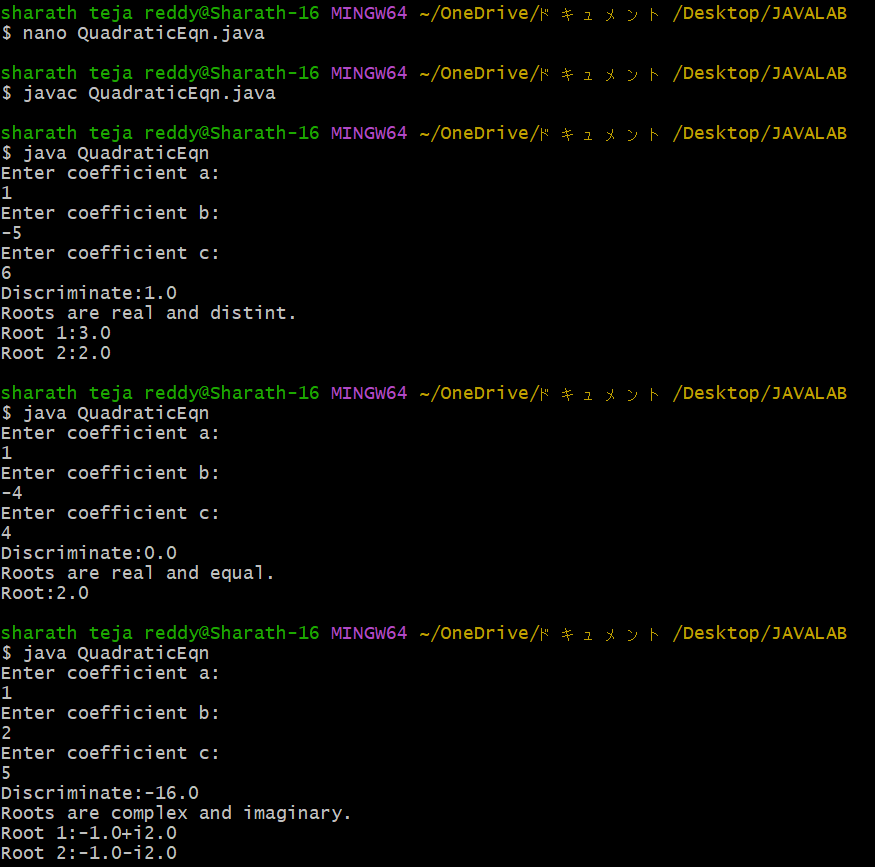

# Experiment1a
## Title : Display Primitive Data Types
```java
public class Defaultvalues{
byte b;
short s;
int i;
long l;
float f;
double d;
char c;
boolean bool;
public static void main(String []args){
Defaultvalues obj=new Defaultvalues();
System.out.println("Default values of primitive data types:");
System.out.println("Default byte value:"+obj.b);
System.out.println("Default short value:"+obj.s);
System.out.println("Default int value:"+obj.i);
System.out.println("Default long value:"+obj.l);
System.out.println("Default float value:"+obj.f);
System.out.println("Default double value:"+obj.d);
System.out.println("Default char value:"+obj.c);
System.out.println("Default boolean value:"+obj.bool);
}
}
```
# output

## Title :Quadratic Equation
```java
import java.util.Scanner;
public class QuadraticEqn{
public static void main(String []args){
Scanner sc=new Scanner(System.in);
System.out.println("Enter coefficient a:");
double a=sc.nextDouble();
System.out.println("Enter coefficient b:");
double b=sc.nextDouble();
System.out.println("Enter coefficient c:");
double c=sc.nextDouble();
double D=b*b-4*a*c;
System.out.println("Discriminate:"+D);
if(D>0){
System.out.println("Roots are real and distint.");
double root1=(-b+Math.sqrt(D))/(2*a);
double root2=(-b-Math.sqrt(D))/(2*a);
System.out.println("Root 1:"+root1);
System.out.println("Root 2:"+root2);
}
else if(D==0){
System.out.println("Roots are real and equal.");
double root=-b/(2*a);
System.out.println("Root:"+root);
}
else{
System.out.println("Roots are complex and imaginary.");
double realpart=-b/(2*a);
double imaginarypart=Math.sqrt(-D)/(2*a);
System.out.println("Root 1:"+realpart+"+i"+imaginarypart);
System.out.println("Root 2:"+realpart+"-i"+imaginarypart);
}
}
}
```
# output



